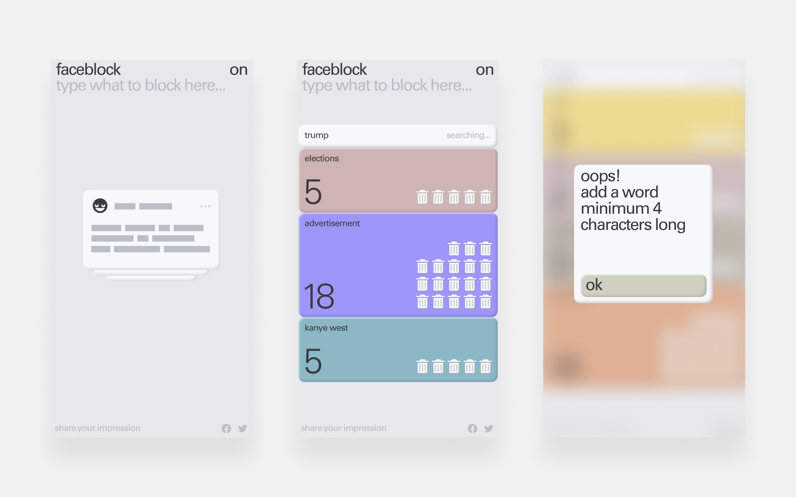

## Faceblock 2.0 — Block Facebook posts about stuff you don't like 
Faceblock is an extension for Google Chrome that blocks posts about stuff you don't like in your Facebook Newsfeed.

Add the name of a politician, pop star or somebody else you are annoyed reading about - and you won't see any more posts mentioning them.
The program shows you how many posts of a given keyword were removed and how many were blocked in general. Also, it's easy to manage a block list and turn Faceblock off and on from the user interface.

[Download here](https://chrome.google.com/webstore/detail/faceblock/aljnhamaajogdndmfnedoodpoofadkph)

(Please reload your Facebook page after install)

Have a great time! :)